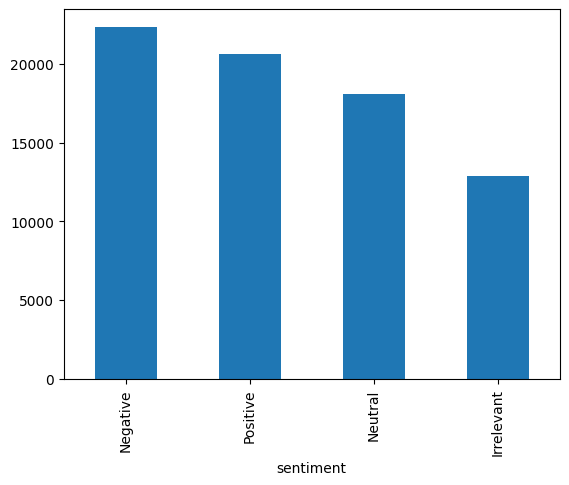
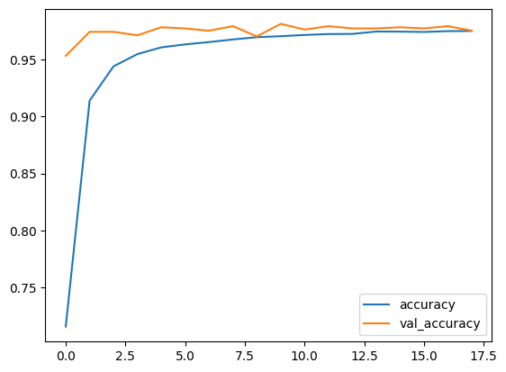
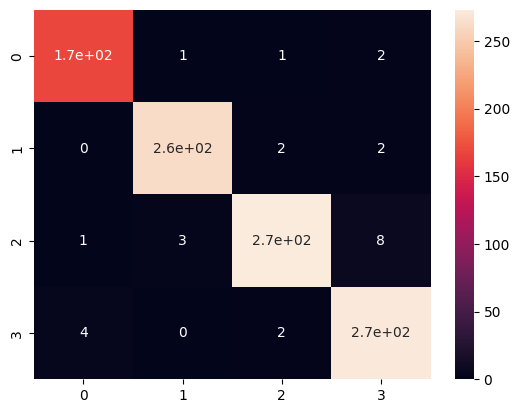
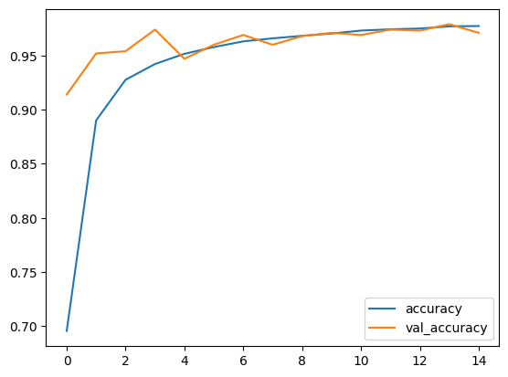
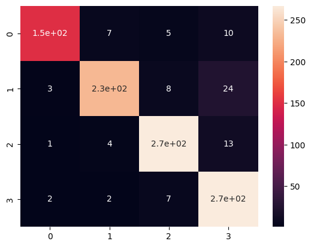

# Twitter Entity Sentiment Analysis: Dense vs GRU Comparative Study

A deep learning project that compares two neural architectures for multiclass sentiment classification on Twitter text: a **Dense neural network** and a **Bidirectional GRU model**.

This repository focuses on a practical question in NLP: for short social-media text, does a sequence-aware recurrent model outperform a simpler dense architecture when both are trained on the same sentiment-analysis task?

## Project Overview

This project performs sentiment classification on tweets from the **Twitter Entity Sentiment Analysis** dataset. The goal is to classify each tweet into one of four sentiment classes:

- Irrelevant
- Negative
- Neutral
- Positive

Two models are trained and evaluated:

- **Dense model**
- **Bidirectional GRU model**

The notebook compares them using training accuracy curves and confusion matrices.

## Dataset

The dataset used in the notebook is the Kaggle **Twitter Entity Sentiment Analysis** dataset. The notebook loads:

- `twitter_training.csv`
- `twitter_validation.csv`

The training data shown in the notebook contains **73,996 rows**, and the validation data contains **1,000 rows** in the processed workflow used for the experiment.

## Problem Statement

Sentiment analysis on tweets is difficult because social-media text is short, noisy, informal, and often context-dependent. This project compares:

1. A dense architecture that treats the representation more directly
2. A GRU-based architecture that can model token sequence information

The comparison is useful because it highlights the trade-off between architectural simplicity and sequence modeling capability.

## Preprocessing Pipeline

The notebook performs a text-classification workflow that includes:

- loading the tweet dataset
- selecting the relevant text and sentiment columns
- encoding the four sentiment labels
- preparing tweet text for neural-network input
- training separate models on the same task

From the notebook outputs, the sentiment labels are converted into four-class targets, and the GRU pipeline uses tokenized sequence input with padding.

## Model 1: Dense Network

The first model is a dense neural network used for multiclass classification.

Architecture from the notebook:

- Dense(128)
- Dropout
- Dense(64)
- Dropout
- Dense(32)
- Dense(4)

The model summary in the notebook reports **3,986,660 trainable parameters**.

## Model 2: Bidirectional GRU

The second model is a sequence-based recurrent model.

Architecture from the notebook:

- Embedding layer with output shape `(None, 40, 128)`
- Bidirectional GRU
- Dense(64)
- Dropout
- Dense(32)
- Dense(4)

The model summary in the notebook reports **2,780,900 trainable parameters**.

## Training Setup

Both models are trained with early stopping based on validation loss. The notebook shows:

- **EarlyStopping**
- monitor: `val_loss`
- mode: `min`
- patience: `15`
- restore best weights: enabled

This helps control overfitting and keeps the final comparison more reliable.

## Results

From the notebook training logs:

- The **Dense model** reaches validation accuracy values up to about **0.981** during training.
- The **Bidirectional GRU model** reaches validation accuracy values up to about **0.979** during training.

In this experiment, both models perform very strongly, and the final comparison suggests that the Dense model is slightly competitive or marginally stronger on the reported validation accuracy curve, while the GRU remains attractive because it explicitly models sequence structure.

Because the repo is comparative, the strongest framing is not “one model wins absolutely,” but that **both models are effective and the Dense baseline is harder to beat than expected on this dataset**.

## Visualizations

### Class distribution



### Dense model performance




### GRU model performance




## Why This Project Matters

This repository demonstrates:

- multiclass sentiment analysis
- neural NLP preprocessing workflows
- comparison of feedforward and recurrent architectures
- model evaluation through validation accuracy and confusion matrices
- practical deep-learning experimentation on real tweet data

It is a solid comparative project because it does not just train one model and stop there. It asks whether added sequence modeling actually changes performance in a meaningful way.

## Repository Structure

```text
.
├── images/
├── sentiment
├── README
├── requirements
└── .gitignore
```

## How to Run

1. Clone the repository.
2. Install dependencies:
   ```bash
   pip install -r requirements.txt
   ```
3. Launch Jupyter Notebook:
   ```bash
   jupyter notebook
   ```
4. Open the notebook and run the cells in order.

## Possible Extensions

Some strong next steps for this project would be:

- adding LSTM and transformer-based baselines
- reporting precision, recall, and F1-score for each class
- handling class imbalance more explicitly
- trying pretrained word embeddings
- comparing topic-aware and topic-agnostic sentiment prediction
- deploying the best model as a simple web app

## Summary

This repository presents a comparative deep-learning study for Twitter sentiment classification using a Dense network and a Bidirectional GRU model.

The key takeaway is that both models perform well on the four-class sentiment task, while the comparison highlights an important engineering insight: a simpler dense baseline can remain highly competitive even when compared against a more sequence-aware recurrent architecture.
